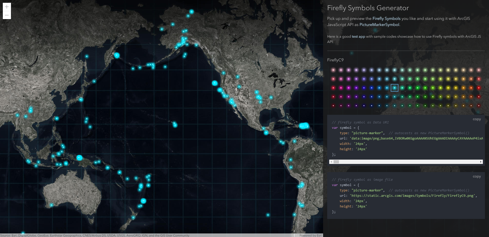

# Firefly Symbols Generator

Wondering how to use the awesome [Firefly Symbols](https://www.esri.com/arcgis-blog/products/arcgis-living-atlas/mapping/whats-new-in-arcgis-online-firefly/) in your ArcGIS JS API apps?

Use this [tool](http://vannizhang.github.io/firefly-symbols-generator/dist) to pick up and preview the Firefly Symbols you like and start using it.

